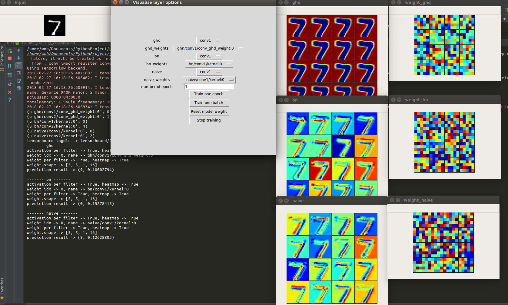

## Implementation of Generalized Hamming Distance Network

This is an re-implementation of the Generalized Hamming Distance Network published in NIPS 2017. 

### Requirements to run
1. python 2.7
2. keras (for dataset)
3. tensorflow
4. pip install -r requirements.txt

### How to run
```
keras: python realtime_training_visualisation.py
```

### Conv2D GHD
```
L = reduce_prod(weights.shape[:3])
hout = 2/L * conv2d(x, w) - mean(weights) - mean(avgpool2d(x, w))

for more informations, refer to nets/tf_layers.py or nets/keras_layers.py
```

### FC GHD
```
L = weights.shape[0]
hout = 2/L * matmul(x, w) - mean(weights) - mean(x)

for more informations, refer to nets/tf_layers.py or nets/keras_layers.py
```

### GHD variable
```
double_threshold - to enable double thresholding
per_pixel - per pixel "r" (only for double threshold = True)
alpha - for how harsh we want to suppress the input range from ghd
relu - paper stated non-linear activation is not essential, but once activated, it set minimal hamming distance threhsold of 0.5
```

### Network visualisation

```
To run network visualisation:

python keras_mnist_visualisation.py

"i" & "k": go through different image
"1": switch activation normalization mode 
"2": switch heatmap visualisation for activation
"3": switch weight normalization mode
"4": switch heatmap visualisation for activation
```

### Mnist image classification with GHD
```
Layers=[
    Conv2D [kernel_size=5],
    MaxPool2D,
    Conv2D [kernel_size=5],
    MaxPool2D,
    Flatten,
    Dropout
    FC,
    FC,
    Softmax
]

loss=CrossEntropy

optimizer=Adam
```

### Experiment Results (Mnist dataset)
At the end of first epoch with `learning rate = 0.1, r = 0`, validation and testing accuracy reaches 94~96% (batch size can affect this)

As stated in the paper, at `log(48000) = 4.68`, accuracy is around 97~98%

Result in table after 1 epoch

| Double Threshold & Relu | Loss   | Accuracy |
| ----------------------- | ------ | -------- |
| True & True             | 0.1342 | 95.93%   |
| True & False            | 0.272  | 90.90%   |
| False & True            | 0.2606 | 91.22%   |
| False & False           | 0.308  | 89.01%   |


### Reference
[1] Fan, L. (2017). Revisit Fuzzy Neural Network: Demystifying Batch Normalization and ReLU with Generalized Hamming Network. Nokia Technologies Tampere, Finland.
[2] https://github.com/kamwoh/deep-visualization
[3] https://github.com/InFoCusp/tf_cnnvis

### Feedback
Suggestions and opinions of this implementation are greatly welcome. Please contact the us by sending email to Kam Woh Ng at `kamwoh at gmail.com` or Chee Seng Chan at `cs.chan at um.edu.my`
